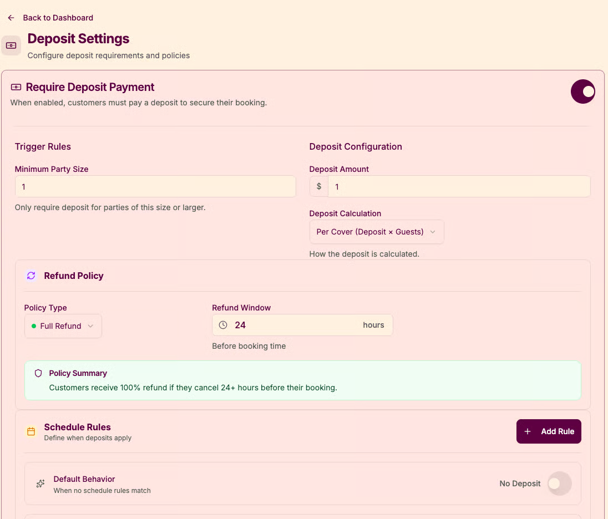

# Deposits

Deposits are configured in the **Deposits** settings and are available to all restaurants on Plate.

You can:

* Turn deposit requirements on or off according to your needs.
* Define which bookings should require a deposit (for example, certain party sizes or key dates).
* Configure deposit amounts and default service fee percentages where applicable.

**How deposits work with settings**

1. In **Settings → Deposits**, review your default rules:
   * When a deposit is required
   * How much is charged
   * Any fees added by your payment providers
2. Once saved, new bookings that match those rules will be marked as requiring a deposit.
3. Staff can then generate payment links directly from the booking.

For the step‑by‑step booking flow using deposits, see **Core Features → Reservations**.

<figure><figcaption></figcaption></figure>
